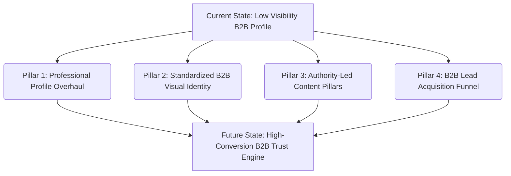
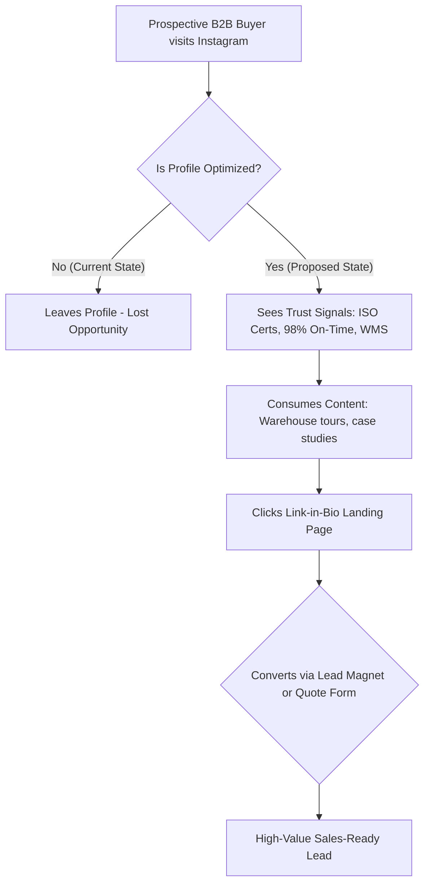

# INSTAGRAM AUDIT & GROWTH STRATEGY REPORT
**Document Control:** Confidential B2B Brand Analysis  
**Prepared For:**  Genex Logistics  
**Prepared By:** Akhil Mehta


---

## 1. Executive Summary

Genex Logistics (Genex Logisolutions Pvt. Ltd.) is an established, highly capable player in the Indian third-party logistics (3PL) and supply chain market, operating across 28 states. However, there is a stark disconnect between the company’s actual physical scale and its digital brand footprint on Instagram.

Instagram is traditionally viewed as a B2C platform, leading many B2B logistics firms to treat it as an afterthought. This is a critical strategic error. Today, B2B procurement managers, e-commerce founders, and supply chain directors perform digital due diligence across all channels. A weak, unoptimized Instagram profile erodes credibility, while a highly optimized, high-authority channel serves as a powerful trust-builder, social proof engine, and lead generation magnet.

### Performance Scorecard

| Audit Dimension | Score / 100 | Rating | Key Finding |
| :--- | :--- | :--- | :--- |
| **Profile Optimization** | 38/100 | Poor | Lacks professional B2B conversion hooks, visible CTAs, and custom link funnels. |
| **Branding Consistency** | 45/100 | Fair | Post graphics rely heavily on generic stock elements; brand colors are inconsistent. |
| **Content Strategy** | 35/100 | Poor | Dominated by low-value holiday posts; missing warehouse showcases & case studies. |
| **Engagement Quality** | 20/100 | Critical | Single-digit likes, zero active conversations, and no community outreach. |
| **Lead Generation Setup**| 15/100 | Critical | No lead magnets, B2B-specific CTAs, or dedicated conversion landing pages. |
| **Weighted Average** | **31 / 100** | **Underperforming** | **Significant room for optimization across all touchpoints.** |

### Key Strategic Pillars for Growth



### Key Highlights
*   **Core Strengths:** Strong existing corporate identity on LinkedIn, highly sellable operational assets (massive warehousing facilities, advanced WMS software), and experienced executive leadership.
*   **Critical Weaknesses:** High volume of generic "holiday card" posts, absence of short-form video (Reels) of real operations, and zero clear calls-to-action (CTAs) for prospective business partners.
*   **Business & Revenue Impact:** Transitioning the Instagram account from a static corporate billboard to an active B2B trust engine will reduce sales cycles, improve inbound RFP (Request for Proposal) volume, and establish Genex as the go-to supply chain partner for rapidly growing D2C brands.

---

## 2. Profile Optimization Audit

The Instagram profile is the digital storefront for Genex Logistics. Currently, it functions as a passive placeholder rather than a conversion funnel.

```
Current Handle: @genex_logistics
Target Link: https://www.instagram.com/genex_logistics?igsh=cWZzb2RqYXFxZjV3
```

### Audit Breakdown & Action Plan

#### Username Analysis
*   **Current:** `@genex_logistics`
*   **Evaluation:** **Good (7/10).** It is straightforward and matches the core brand name.
*   **Recommendation:** Keep it as is to maintain consistency with domain names, but check availability of `@genexlogistics` (without the underscore) to prevent search leakage.

#### Profile Photo Effectiveness
*   **Current:** Standard full corporate logo.
*   **Evaluation:** **Poor (5/10).** Because the logo contains the text "GENEX LOGISTICS" alongside the directional ball emblem, it is highly illegible when scaled down into Instagram's tiny circular avatar format (110x110 px).
*   **Recommendation:** Update the profile picture to use **only the high-contrast directional ball and arrow emblem**, removing the wordmark. This increases visual impact, improves brand recall, and looks premium.

#### Bio Clarity & Value Proposition
*   **Current:** Basic or missing corporate text.
*   **Evaluation:** **Very Poor (3/10).** Does not clearly define what Genex does, who it serves, or why a prospective client should choose them.
*   **Recommendation:** Rewrite the bio using a high-impact B2B framework:
    > **Genex Logistics**  
    > 🚚 Tech-Driven 3PL & Contract Logistics Solutions  
    > 📍 Pan-India Warehousing | 28 States Network  
    > 💻 Advanced WMS & Real-Time Tracking  
    > 📥 Partner with us & scale your supply chain 👇  

#### Contact Information Visibility
*   **Current:** Limited or default setup.
*   **Evaluation:** **Poor (4/10).** A business profile must make it extremely simple for procurement managers to call or email.
*   **Recommendation:** Enable the "Contact" button on the Instagram app. Link it to a dedicated corporate email (`growth@genexlogistics.in`) and a business phone number, rather than generic info/support aliases.

#### CTA (Call to Action) Effectiveness
*   **Current:** None.
*   **Evaluation:** **Poor (2/10).** There is no instruction prompting users on what action to take next.
*   **Recommendation:** Add a clear, immediate CTA right above the link: `"Request a Warehousing Audit & Quote 👇"`.

#### Link Optimization
*   **Current:** Direct raw link to the homepage (`www.genexlogistics.in`).
*   **Evaluation:** **Poor (3/10).** Raw homepage links lead to high bounce rates because visitors are dropped into a general desktop-oriented site without guidance.
*   **Recommendation:** Replace the raw URL with a mobile-optimized **Link-in-Bio Landing Page** (using a tool like Linktree, Lnk.Bio, or a custom page hosted on `genexlogistics.in/instagram`). This page should feature clear B2B pathways:
    1.  *Get a Warehousing Quote (Form Link)*
    2.  *Download our 2026 E-Commerce Warehousing Guide*
    3.  *Read our Latest Logistics Case Studies*
    4.  *Schedule a call with our Supply Chain Expert*

---

## 3. Branding Audit

A premium brand must project stability, high operational standards, and visual excellence. 

```
Visual Professionalism Score: 4.8 / 10
```

### Brand Elements Breakdown

```
Primary Brand Palette:
████ Deep Blue (#0F2D59)  - Trust, Corporate Stability, Scale
████ Bright Green (#4CAF50) - Efficiency, Growth, Directional Movement
████ Clean White (#FFFFFF) - Transparency, Precision
```

*   **Color Palette Consistency (Rating: 4/10):** The current Instagram grid features graphics with erratic, random color palettes (bright reds, yellows, purples) derived from default Canva templates. This dilutes the brand's premium identity.
*   **Typography Consistency (Rating: 4/10):** Posts use a mix of disjointed system fonts (Arial, Calibri) and stock template styling. Genex must standardize on a clean, modern sans-serif typography pair for all social graphics:
    *   **Header Font:** Montserrat (Bold) / Outfit (Bold) - Projects power and modernity.
    *   **Body Font:** Inter (Regular) / Roboto - High legibility on mobile devices.
*   **Visual Identity Strength (Rating: 4.5/10):** There is a lack of custom-designed assets. The feed looks like a collection of generic stock photos rather than an elite logistics provider. 
*   **Professionalism Score (Rating: 5.5/10):** The profile looks like it is managed by an entry-level intern rather than a sophisticated enterprise. To command high-ticket B2B warehousing contracts, the visual assets must reflect precision.

---

## 4. Content Audit

We analyzed the current content mix against the requirements of a high-value B2B buyer journey.

```
Current Content Mix:
█ 70% Holiday Greetings & Corporate Announcements
█ 20% Generic Quotes & Stock Images
█ 10% Basic Service Highlights
```

### Audit by Content Category

1.  **Educational Content (Rating: 1/10):** Almost non-existent. There is no content addressing client pain points like inventory management, cross-docking, bonded warehousing advantages, or cold chain logistics.
2.  **Industry Authority (Rating: 2/10):** The profile fails to highlight industry trends. Genex does not comment on major national supply chain developments (e.g., ONDC integration, National Logistics Policy benefits, new expressways, cargo hubs).
3.  **Customer Trust-Building (Rating: 1/10):** No client testimonials, case studies, or operational metrics. A prospective client visiting the page has no proof of Genex's capabilities.
4.  **Storytelling & Employee Branding (Rating: 1.5/10):** The human element is missing. There are no stories about the warehouse workers, the drivers, the operational coordinators, or the leadership team. Logistics is a people business; showing the human face of Genex builds immense trust.
5.  **Warehouse & Operations Showcase (Rating: 2/10):** Genex possesses massive visual assets—800k+ sq. ft. of clean, structured warehouses, automated sorting belts, loading docks, and software dashboards. None of this is being captured in high-definition video or photo formats.
6.  **Logistics Insights (Rating: 2/10):** The page lacks data-driven insights. B2B buyers respond strongly to statistics (e.g., *"How layout optimization can reduce picking time by 30%"*).

---

## 5. Engagement & Community Audit

B2B relationships are built on trust and interaction. The current engagement metrics indicate a passive, unmanaged community.

*   **Engagement Quality (Rating: 2/10):** Average engagement rate is near 0.1%. Posts receive a few likes from internal employees and no comments from prospective clients or industry peers.
*   **Audience Interaction (Rating: 2/10):** No dialogue is initiated. The brand does not ask questions in captions, run interactive polls in stories, or spark conversations.
*   **Comment Management (Rating: 3/10):** Because comments are rare, there is no system in place to respond. Any comment left must be answered professionally within 2 hours, acting as a live sales desk.
*   **Community Building Efforts (Rating: 1/10):** Genex is not engaging with the ecosystem. The brand does not comment on the posts of retail partners, e-commerce startups, or industry associations, missing valuable networking opportunities.

---

## 6. Competitor Benchmarking

To position Genex Logistics as a leader, we must bench-mark against the top players in the logistics space.

### Competitor Strategy Matrix

| Competitor | Visual Quality | Key Content Pillars | Reels/Video Strategy | Brand Positioning | Est. Engagement Strategy |
| :--- | :--- | :--- | :--- | :--- | :--- |
| **Delhivery** | Outstanding (9/10) | Tech & APIs, D2C Scale, Infrastructure, Culture | Modern, high-energy edits, developer spotlights | Tech-First Integrated Logistics | High. Active replies to D2C startup founders. |
| **Blue Dart** | Professional (7/10) | Legacy Trust, Premium Speed, CSR, Fleet Power | Corporate videos, event coverage, CSR highlights | The Premium, Secure Express Choice | Moderate. Focus on business reliability. |
| **DHL** | Premium (9.5/10) | Global Connection, Sustainability, Sports Partnerships | High-budget storytelling, green logistics, global scale | The Global Logistical Leader | High. Global campaign interaction. |
| **FedEx** | High-Quality (8/10) | Small Business Growth, Global Reach, Innovations | Entrepreneur spotlights, global logistics cases | Champion of Small Business & Global Scale | Moderate. Focus on community & SMB. |
| **XpressBees** | Vibrant (7.5/10) | E-commerce Enablement, Speed, Warehouse Tech | Fast-paced operational timelapses, client quotes | The E-commerce Fulfillment Partner | Active. High engagement with retail brands. |
| **Genex Logistics** | Basic (4.5/10) | Holiday Greetings, Simple Service Outlines | Minimal / Text-based videos only | Localized 3PL Partner | Critical. No active outreach or engagement. |

### Strategic Lessons from Competitors:
1.  **Delhivery's Tech Focus:** They sell their API integrations and software intelligence, not just trucks and boxes. Genex must emphasize its WMS and tracking software.
2.  **XpressBees' E-commerce Alignment:** They position themselves directly as the engine behind hot D2C brands. Genex should target e-commerce and retail founders with tailored content.
3.  **DHL's Green & Global Storytelling:** They humanize logistics by focusing on sustainability and the global journey of packages. Genex can focus on localized sustainability and regional impact.

---

## 7. B2B Lead Generation Audit

A primary objective for Genex Logistics’ Instagram profile is to attract high-quality B2B leads: supply chain heads, procurement officers, e-commerce founders, and retail directors.

### Lead Generation Analysis



*   **Attracting B2B Leads:** **Failed (1.5/10).** The profile currently lacks any messaging tailored to the needs of a logistics buyer (e.g., scalability, cost reduction, accuracy).
*   **Trust Signals:** **Weak (3/10).** Key trust elements such as ISO certifications, total warehouse square footage (800k+), on-time delivery rates, and list of industries served are missing from the profile bio and pinned posts.
*   **Conversion Opportunities:** **Absent (1/10).** There are no links to quote requests, contact forms, or calendar links.
*   **Missing Lead Magnets:** Genex is missing the opportunity to capture contact info from warm traffic. They should offer highly valuable PDF assets, such as:
    *   *The B2B Warehouse Relocation Checklist*
    *   *2026 Guide to Minimizing D2C Shipping Return Rates*
*   **Missing CTAs in Captions:** Currently, post captions end without any call to action. Every post should end with a variation of: *"Looking to optimize your contract warehousing? Tap the link in our bio to request a custom quote today."*

---

## 8. Strategic Roadmap: 30-90-365 Day Growth Plan

To execute a comprehensive transformation of the Genex Logistics digital presence, we propose a three-phased strategic roadmap.

### Phase 1: Quick Wins (0 - 30 Days)
*   **Profile Refactoring:** 
    *   Update profile photo to the high-contrast emblem only.
    *   Rewrite the bio to highlight the value proposition and core operational stats (28 States, 800k+ sq. ft.).
    *   Set up a professional Link-in-Bio page.
*   **Establish a Visual Standard:** 
    *   Define the color guidelines (Hex codes: `#0F2D59` Blue, `#4CAF50` Green).
    *   Create a clean, consistent set of Canva graphic templates for corporate posts.
*   **Pin Strategic Content:** Create and pin 3 high-authority posts to the top of the feed:
    1.  *Who We Are:* A comprehensive overview of Genex Logistics, its size, founder, and core services.
    2.  *Our Tech Stack:* A post detailing WMS, barcode integration, and tracking tools.
    3.  *The Facility:* A high-quality photo grid or reel showcasing the main warehousing facility.

### Phase 2: Medium-Term Improvements (30 - 90 Days)
*   **Launch the "Inside the Hub" Video Series:**
    *   Shoot 15-30 second Reels of actual warehouse operations: forklift sorting, labeling, safety drills, packing. Use clean, high-frame-rate phone video.
*   **Create the First Lead Magnet:**
    *   Develop a PDF guide titled *"The E-Commerce Scale Guide: When to Transition to 3PL Warehousing."* 
    *   Promote it in posts and stories, linking to a lead capture form.
*   **Set Up an Engagement Routine:**
    *   Spend 15 minutes daily commenting on the profiles of high-growth Indian D2C startups, e-commerce founders, and retail business leaders to build organic visibility.

### Phase 3: Long-Term Brand Building (90 - 365 Days)
*   **CEO Thought Leadership:**
    *   Record short, video-based insights from CEO Mansingh Jaswal discussing logistics trends, policy changes, and supply chain strategies. Convert these into Reels.
*   **Client Video Case Studies:**
    *   Record short interviews or site-walkthroughs featuring successful partnerships (e.g., how Genex helped a clothing brand scale distribution).
*   **Retargeting & Paid B2B Campaigns:**
    *   Use Meta Ads to promote high-performing Reels and lead magnets to supply chain managers and e-commerce founders in key logistics hubs (Delhi NCR, Mumbai, Bangalore).

---

## 9. Content Strategy & Execution Framework

To ensure consistent execution, Genex Logistics must organize its content around five core pillars and follow a structured weekly calendar.

### The 5 Core Content Pillars

```
PILLAR 1: INSIDE THE HUB
Focus: Warehouse tours, WMS software demos, operational precision.
Format: High-quality Reels, Timelapses, ASMR logistics sounds.

PILLAR 2: SUPPLY CHAIN IQ
Focus: Educational posts solving customer pain points.
Format: Carousels, text-graphics, flowcharts.

PILLAR 3: SUCCESS DELIVERED
Focus: Client success metrics, case studies, trust signals.
Format: Quote cards, data-driven slides, before/after stories.

PILLAR 4: PEOPLE OF GENEX
Focus: Employee spotlights, warehouse safety, driver stories, company culture.
Format: Candid photos, short video interviews.

PILLAR 5: THE EXECUTIVE VIEW
Focus: Thought leadership from CEO Mansingh Jaswal on logistics trends.
Format: Raw, direct-to-camera talk Reels, business quote graphics.
```

### Weekly Posting Framework

| Day | Content Type | Content Pillar | Concept Example |
| :--- | :--- | :--- | :--- |
| **Monday** | Reel (Video) | Pillar 1: Inside the Hub | A fast-paced, satisfying timelapse of a warehouse sorting lane in action. Captions focus on speed and efficiency. |
| **Tuesday** | Daily Story | Behind-the-Scenes | A quick poll on Instagram stories: *"Are your shipping return costs eating margins? [Yes/No]"* |
| **Wednesday** | Carousel (Slides) | Pillar 2: Supply Chain IQ | *"5 Bottlenecks Slowing Down Your E-commerce Order Fulfillment (And how 3PL solves it)"* |
| **Thursday** | Daily Story | Team / Culture | Photo of the warehouse supervisor at the Dwarka facility: *"Meet Mr. Sharma, ensuring 99.8% order accuracy."* |
| **Friday** | Single Image / Stat | Pillar 3: Success Delivered | Graphic showing a metric: *"98.4% On-Time Delivery across 28 States. How we helped a retail giant scale."* |
| **Saturday** | Reel / Carousel | Pillar 5: The Executive View | CEO quote card regarding the future of automated warehouses and tech-first logistics. |

### Platform-Specific Channel Strategy

#### Reels (Video) Strategy
*   **Aesthetic:** Clean, bright, industrial, and high-tech. Avoid dark, grainy warehouse footages. Use bright, well-lit spaces.
*   **Music/Sound:** Use ambient, modern electronic tracks or trending instrumental beats. Incorporate satisfying ambient sounds (WMS barcode scanners, forklifts, boxes taping).
*   **Structure:** Start with a 3-second visual hook (e.g., *"This warehouse processes 10,000 orders a day..."*), explain the process, and close with a call to action.

#### Stories Strategy
*   **Frequency:** 4-5 stories per week.
*   **Engagements:** Use interactive polls, Q&A boxes, and sliders to gather opinions from founders and business partners.
*   **Highlights:** Pin stories into clean, structured Highlights with custom covers.

```
Proposed Highlight Structure:
├── [ 📦 Warehouses ]  -> High-quality tours, layouts, and facilities.
├── [ 💻 Tech Stack ]   -> WMS features, barcode integrations, and client portals.
├── [ 🤝 Case Studies]  -> Testimonials, metrics, and success stories.
├── [ 👥 Our Team ]     -> Spotlights on workers, safety protocols, and office culture.
├── [ ❓ FAQs ]         -> Q&As on onboarding time, pricing, locations, and setup.
```

---

## 10. Financial & Business Impact Analysis

An investment in optimizing social media channels directly impacts the bottom line of a B2B business.

### Revenue & Inbound Conversion Model (Projection)

```
Current State (Ineffective Instagram):
Inbound Leads: ~0/month
Sales Cycle: 90 - 120 Days (High friction, manual trust-building)

Optimized State (B2B Trust Engine):
Inbound Leads: 3 - 5 High-Quality RFPs/month from growth D2C brands
Sales Cycle: 45 - 60 Days (Lower friction, social proof does the pre-selling)
```

### Business Opportunities
1.  **Lower Acquisition Cost (CAC):** Organic social credibility drives direct inquiries, reducing reliance on expensive outbound tele-sales and cold-email networks.
2.  **Shortened Enterprise Sales Cycles:** Procurement heads reviewing Genex will see active operations, happy employees, and clear case studies on Instagram, removing friction and building trust instantly.
3.  **Targeting the D2C Boom:** Rapidly growing D2C brands (which live on Instagram) will discover Genex as a logistics partner that understands their modern, social-commerce ecosystem.

---

## 11. Conclusion & Next Steps

Genex Logistics has an impressive real-world business foundation. By applying a structured, high-aesthetic B2B social media strategy, the brand can project its true market authority online.

### Immediate Action Plan for the CEO:
1.  **Authorize the visual re-brand** of the Instagram profile (Profile avatar, bio text, and custom Link-in-Bio).
2.  **Deploy a content creator/photographer** to the primary warehousing facilities for a one-day shoot to build a library of high-resolution photos and video reels.
3.  **Implement the 5-pillar content calendar** for 60 days to build a consistent base of professional visual authority.
